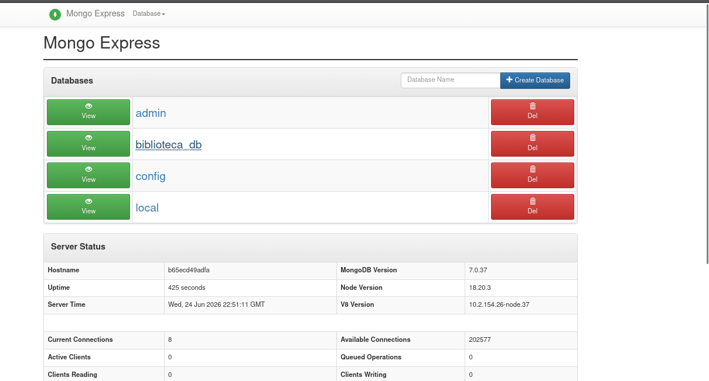
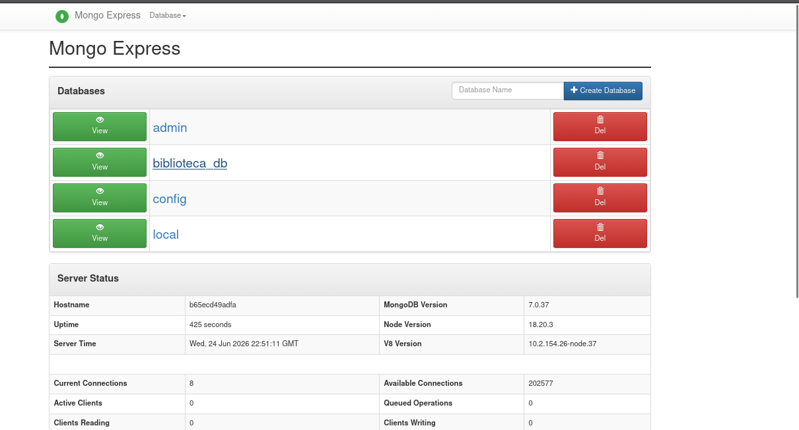

# Práctica 8: Implementación de MongoDB con Docker
**Estudiante:** Fernando Saavedra  
**Asignatura:** Estructura de Datos 2

## 1. Descripción
Implementación de un sistema de base de datos documental utilizando **MongoDB** para el almacenamiento de datos y **Mongo Express** como interfaz de administración web. El despliegue de los servicios se realiza de forma contenerizada mediante **Docker Compose**.

## 2. Requisitos Previos
* [Docker](https://www.docker.com/) instalado.
* [Docker Compose](https://docs.docker.com/) instalado.

## 3. Configuración del Entorno
Antes de iniciar los contenedores, asegúrate de crear un archivo `.env` en la raíz del proyecto para gestionar las credenciales de forma segura:

```env
MONGO_INITDB_ROOT_USERNAME=admin
MONGO_INITDB_ROOT_PASSWORD=password123
ME_CONFIG_MONGODB_ADMINUSERNAME=admin
ME_CONFIG_MONGODB_ADMINPASSWORD=password123
ME_CONFIG_MONGODB_SERVER=mongo-server
ME_CONFIG_BASICAUTH_USERNAME=admin
ME_CONFIG_BASICAUTH_PASSWORD=pass
```
## 4. Instrucciones de Ejecución

Para poner en marcha el sistema, sigue estos pasos desde la terminal dentro de la carpeta del proyecto:

### Paso A: Levantar los contenedores
Ejecuta el comando principal para iniciar los servicios en segundo plano:

```bash
docker compose up -d
```

### Paso B: Verificar el estado

Puedes confirmar que los contenedores están corriendo correctamente con:
Bash

docker compose ps

### Paso C: Acceso a los servicios

Una vez que los contenedores estén activos, puedes gestionar tu base de datos a través de:

    Interfaz Gráfica: Abre tu navegador y dirígete a http://localhost:8081. Deberás iniciar sesión con las credenciales configuradas en tu .env.

    Acceso Directo (CLI): Si prefieres la línea de comandos, accede al motor de base de datos con:

Bash

    docker exec -it mongo-server mongosh -u admin -p password123
    ```

### Paso D: Detener el sistema
Cuando termines tu práctica, puedes detener los contenedores con:

```bash
docker compose down
```

## IMAGENES


