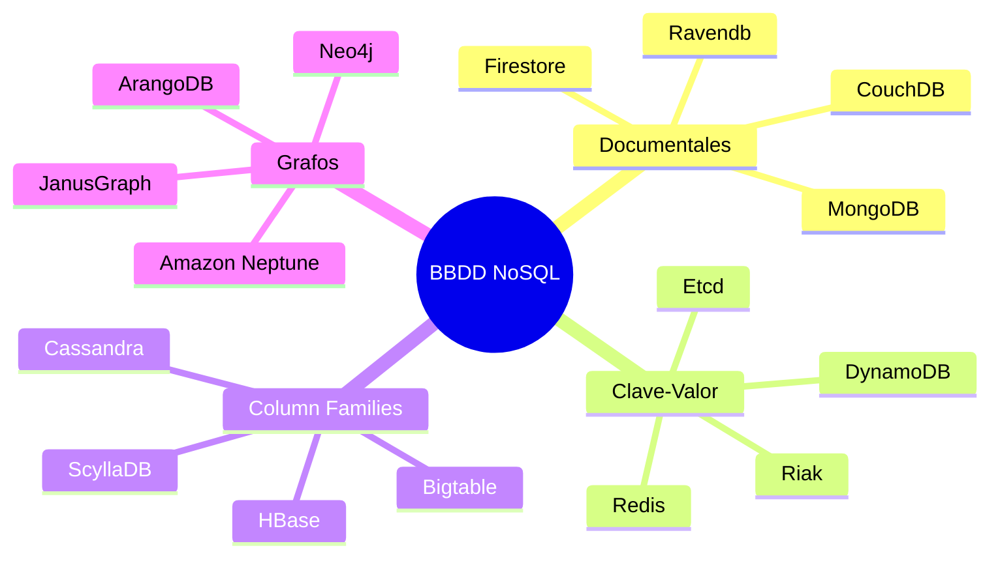
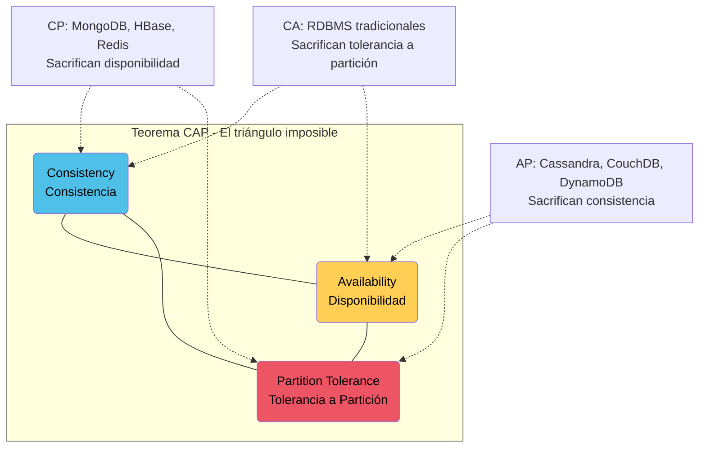
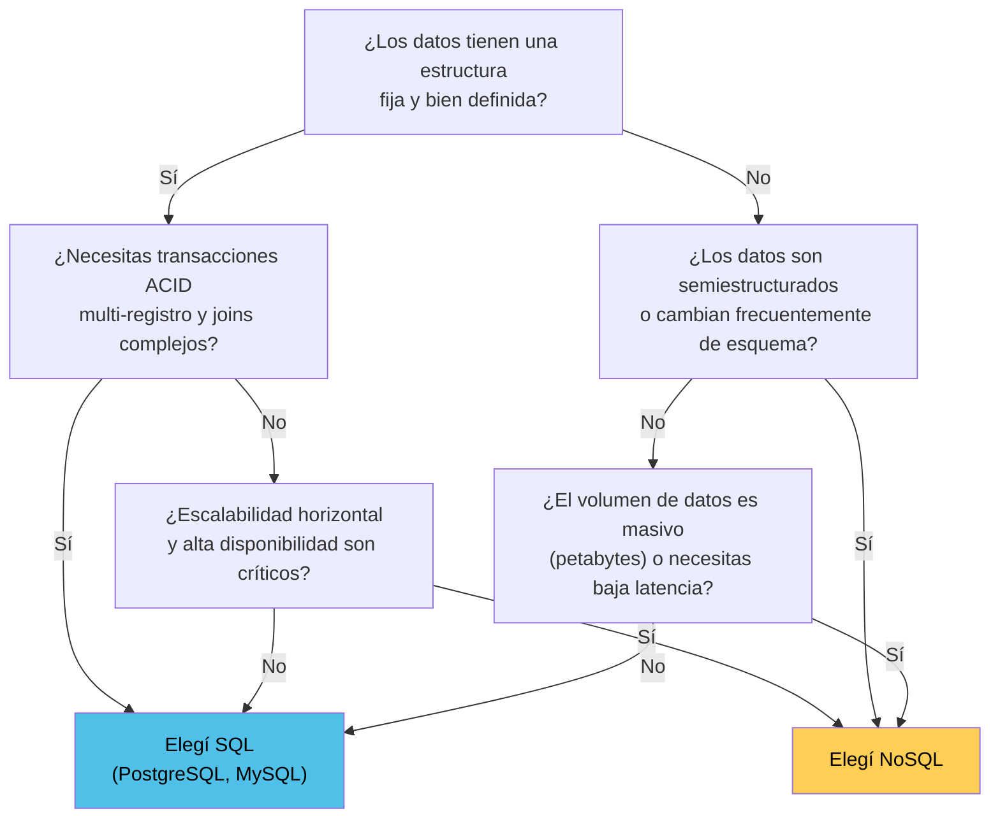
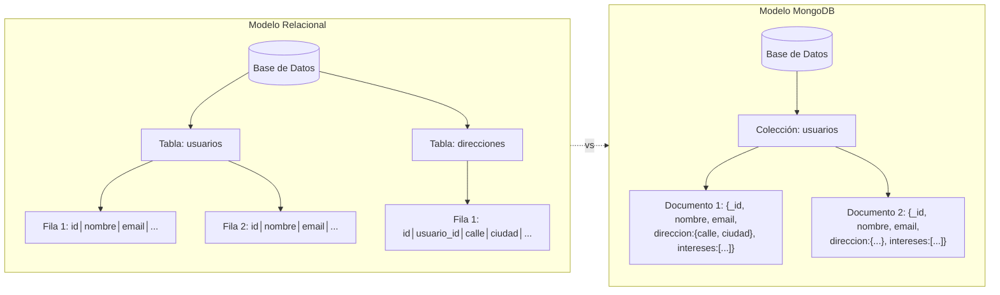
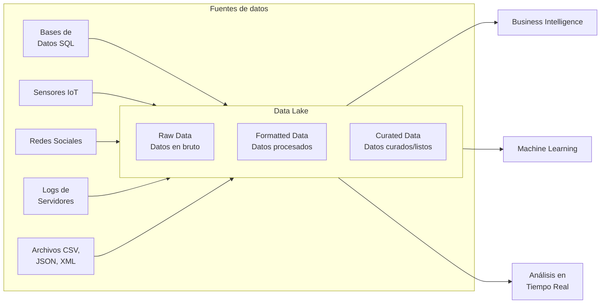

# 1. Introducción a NoSQL

> [← Volver al README](../README.md)

---

## Índice

1. [¿Qué es NoSQL?](#11-qué-es-nosql)
2. [Clasificación de las Bases de Datos NoSQL](#12-clasificación-de-las-bases-de-datos-nosql)
3. [Análisis detallado por tipo](#13-análisis-detallado-por-tipo)
4. [Teorema CAP](#14-teorema-cap)
5. [Ventajas y Desventajas NoSQL vs SQL](#15-ventajas-y-desventajas-nosql-vs-sql)
6. [¿Cuándo usar NoSQL vs SQL?](#16-cuándo-usar-nosql-vs-sql)
7. [MongoDB en profundidad](#17-mongodb-en-profundidad)
8. [Tendencias: Big Data, Data Lakes y análisis en tiempo real](#18-tendencias-big-data-data-lakes-y-análisis-en-tiempo-real)

---

## 1.1 ¿Qué es NoSQL?

**NoSQL** (acrónimo de *Not Only SQL*) es una categoría de sistemas de gestión de bases de datos que se diferencia del modelo relacional clásico (RDBMS) al no exigir un esquema fijo, no usar principalmente el lenguaje SQL y priorizar la **escalabilidad horizontal** y el **alto rendimiento** sobre la consistencia estricta.

El término fue popularizado en 2009 por Carlo Strozzi, aunque sistemas como **Bigtable** (Google, 2004), **Dynamo** (Amazon, 2007) y **MongoDB** (2009) ya habían sentado las bases.

### ¿Por qué surgió NoSQL?

Las bases de datos relacionales fueron diseñadas en los años 70 para entornos con datos estructurados, transacciones ACID y escalabilidad vertical (más CPU/RAM en un solo servidor). Con la explosión de la web 2.0, redes sociales, IoT y Big Data, surgieron necesidades que el modelo relacional no cubría bien:

- **Volúmenes masivos de datos** (terabytes/petabytes)
- **Cargas de trabajo distribuidas** en cientos de servidores
- **Esquemas flexibles** para datos semiestructurados o no estructurados
- **Baja latencia** a escala global
- **Despliegues ágiles** (cambios de esquema sin downtime)

### Diferencias fundamentales: SQL vs NoSQL

| Característica | SQL (Relacional) | NoSQL |
|:---------------|:-----------------|:------|
| **Esquema** | Fijo, definido previamente (tablas, columnas, tipos) | Dinámico / *schema-less* (cada documento puede tener su propia estructura) |
| **Lenguaje** | SQL estandarizado | APIs propias, cada DBMS tiene su interfaz |
| **Escalabilidad** | Vertical (más hardware en un nodo) | Horizontal (más nodos en un clúster) |
| **Transacciones** | ACID | BASE |
| **Modelo de datos** | Tablas, filas, columnas, relaciones (FK) | Documentos, clave-valor, grafos, columnas anchas |
| **Consistencia** | Fuerte (inmediata) | Eventual o configurable |
| **Madurez** | 50+ años, ecosistema muy maduro | 15+ años, ecosistema maduro pero en evolución |

---

## 1.2 Clasificación de las Bases de Datos NoSQL



Cada tipo responde a un **patrón de acceso** y **modelo de datos** diferente. Se analizan en detalle a continuación.

---

## 1.3 Análisis detallado por tipo

### 1.3.1 Bases de datos Documentales

**Modelo:** Almacenan datos como documentos en formato JSON, BSON o XML. Cada documento es una unidad autónoma con estructura anidada.

```json
{
  "_id": ObjectId("661a3c4f..."),
  "nombre": "Gastón",
  "email": "gaston@example.com",
  "direccion": {
    "calle": "Av. Siempre Viva",
    "numero": 742,
    "ciudad": "Córdoba"
  },
  "intereses": ["programación", "bases de datos", "IA"]
}
```

| Aspecto | Detalle |
|:--------|:--------|
| **Ventajas** | Flexibilidad de esquema, mapeo natural a objetos del lenguaje (JSON nativo en JS/TS/Python), consultas ricas, índices sobre campos anidados |
| **Desventajas** | Join no nativo (se hace en aplicación o con `$lookup`), duplicación de datos (denormalización), tamaño de documentos puede ser un problema |
| **Casos de uso** | Catálogos de productos, perfiles de usuario, sistemas de contenido (CMS), logging, aplicaciones web/mobile |
| **DBMS destacados** | **MongoDB**, CouchDB, Couchbase, Firestore, RavenDB |

### 1.3.2 Bases de datos Clave-Valor

**Modelo:** Diccionario hash donde cada valor se accede mediante una clave única. Es la abstracción más simple.

```
clave: "usuario:1234"
valor: "{"nombre":"Gastón","email":"gaston@example.com"}"

clave: "session:token_abc"
valor: "661a3c4f..." (ID de usuario)
```

| Aspecto | Detalle |
|:--------|:--------|
| **Ventajas** | Latencia ultrabaja (microsegundos), extremadamente simples, alto throughput, ideales para caching |
| **Desventajas** | Sin consultas complejas, sin relaciones, sin índices secundarios naturales, toda la lógica de negocio recae en la aplicación |
| **Casos de uso** | Caché distribuida, sesiones de usuario, colas de mensajes, contadores, leaderboards |
| **DBMS destacados** | **Redis**, Amazon DynamoDB, Riak, Etcd |

### 1.3.3 Bases de datos de Column Families (Anchas)

**Modelo:** Almacenan datos en filas que pueden tener un número variable de columnas, agrupadas en familias. No confundir con columnas de SQL: aquí cada fila puede tener columnas diferentes.

```
Fila "usuario_1234":
  Familia "info":     { "nombre": "Gastón", "email": "gaston@example.com" }
  Familia "prefs":    { "theme": "dark", "lang": "es" }
  Familia "activity": { "last_login": "2026-06-10", "logins_count": "42" }
```

| Aspecto | Detalle |
|:--------|:--------|
| **Ventajas** | Escritura masiva horizontal, compresión por columna, excelente para time-series, alta disponibilidad nativa |
| **Desventajas** | Modelo complejo de diseñar, consistencia eventual por defecto, consultas limitadas (mejor por clave de fila) |
| **Casos de uso** | Time-series / IoT, logs de eventos, recomendaciones, big data analytics |
| **DBMS destacados** | **Apache Cassandra**, HBase, ScyllaDB, Google Bigtable |

### 1.3.4 Bases de datos de Grafos

**Modelo:** Nodos (entidades) y aristas (relaciones) con propiedades. Optimizado para recorrer relaciones.

```
(Nodo: Persona {nombre: "Gastón"})
  ──[arista: AMIGO_DE {desde: 2020}]──>
(Nodo: Persona {nombre: "María"})
  ──[arista: ESTUDIA_EN]──>
(Nodo: Universidad {nombre: "UCATec"})
```

| Aspecto | Detalle |
|:--------|:--------|
| **Ventajas** | Relaciones como ciudadanos de primera clase, consultas de recorrido extremadamente rápidas, modelo intuitivo para datos muy conectados |
| **Desventajas** | Escalabilidad horizontal compleja, no apto para consultas masivas de agregación, nicho de aplicación específico |
| **Casos de uso** | Redes sociales, motores de recomendación, detección de fraudes, grafos de conocimiento, rutas/logística |
| **DBMS destacados** | **Neo4j**, ArangoDB (multimodelo), Amazon Neptune, JanusGraph |

### 1.3.5 Comparativa general

| Tipo | Rendimiento | Escalabilidad | Flexibilidad | Complejidad | Caso fuerte |
|:----|:-----------|:--------------|:-------------|:------------|:------------|
| Documental | Alto | Alta | Muy alta | Baja | CRUD sobre datos semiestructurados |
| Clave-Valor | Muy alto | Muy alta | Media | Muy baja | Caching, sesiones |
| Column Families | Muy alto | Muy alta | Media | Alta | Time-series, escritura masiva |
| Grafos | Medio | Media | Muy alta | Alta | Datos conectados, relaciones |

---

## 1.4 Teorema CAP

### 1.4.1 ¿Qué es el Teorema CAP?

Formulado por Eric Brewer en el año 2000, establece que un sistema distribuido de almacenamiento puede garantizar **como máximo 2 de las siguientes 3 propiedades**:



- **C — Consistency (Consistencia):** Todos los nodos ven los mismos datos al mismo tiempo. Si se escribe un dato, cualquier lectura posterior lo verá.
- **A — Availability (Disponibilidad):** Cada petición recibe una respuesta (exitosa o no), incluso si algunos nodos fallan.
- **P — Partition Tolerance (Tolerancia a Partición):** El sistema sigue funcionando aunque la comunicación entre nodos se interrumpa (partición de red).

### 1.4.2 Implicaciones prácticas

| Combinación | Qué significa | DBMS ejemplo |
|:------------|:--------------|:-------------|
| **CP** | Ante una partición de red, el sistema **detiene escrituras** para mantener consistencia | MongoDB (por defecto), HBase, Redis |
| **AP** | Ante una partición, el sistema **sigue aceptando operaciones** aunque los datos puedan ser inconsistentes temporalmente | Cassandra, CouchDB, DynamoDB |
| **CA** | **No tolera particiones de red.** Si la red se divide, el sistema deja de funcionar | PostgreSQL, MySQL (mononodo) |

> Las particiones de red son inevitables en sistemas distribuidos, por lo que la mayoría de los DBMS NoSQL eligen entre CP y AP. MongoDB es **CP por defecto** pero permite configurar *read concern* para relajar la consistencia.

---

## 1.5 Ventajas y Desventajas NoSQL vs SQL

### Tabla comparativa detallada

| Aspecto | SQL | NoSQL |
|:--------|:----|:------|
| **Modelo de datos** | Tablas, filas, columnas, claves foráneas | Documentos, clave-valor, column families, grafos |
| **Esquema** | Fijo, debe definirse antes de insertar | Dinámico, cada registro puede tener campos distintos |
| **Lenguaje de consulta** | SQL estandarizado | API propia o dialecto específico |
| **Transacciones** | ACID — multi-fila, multi-tabla | BASE — generalmente limitadas a un solo documento/registro (MongoDB 4.0+ soporta multi-documento) |
| **Escalabilidad** | Vertical: más CPU/RAM/disco en un servidor | Horizontal: añadir nodos al clúster |
| **Consistencia** | Fuerte (inmediata, configurable) | Eventual por defecto (configurable según DBMS) |
| **Disponibilidad** | Depende del hardware; requiere clustering complejo | Alta disponibilidad nativa (replica sets, nodos) |
| **Rendimiento lecturas** | Alto con índices, decrece con joins complejos | Muy alto en lecturas por clave primaria |
| **Rendimiento escrituras** | Moderado, limitado por el nodo principal | Muy alto en escritura distribuida |
| **Madurez** | 50+ años, ecosistema enorme | 15+ años, madurez variable según el producto |
| **Casos típicos** | ERP, finanzas, facturación, datos con muchas relaciones | Web apps, IoT, catálogos, caché, redes sociales |

---

## 1.6 ¿Cuándo usar NoSQL vs SQL?



### Guía rápida de decisión

| Situación | Recomendación |
|:----------|:--------------|
| Sistema financiero, contable, ERP | **SQL** — necesitás ACID fuerte y relaciones complejas |
| Catálogo de productos con campos variables | **NoSQL (Documental)** |
| Caché de sesiones de usuario | **NoSQL (Clave-Valor)** |
| Red social con relaciones complejas | **NoSQL (Grafos)** |
| Time-series de sensores IoT | **NoSQL (Column Families)** |
| Aplicación web/mobile moderna | **NoSQL (Documental)** — JSON nativo, escalabilidad horizontal |
| Sistema de logs / eventos | **NoSQL (Documental o Column Families)** |
| Recomendaciones en tiempo real | **NoSQL (Grafos o Documental)** |

> **Polyglot Persistence:** Es cada vez más común usar **múltiples DBMS** en un mismo sistema, cada uno para el tipo de dato que mejor maneja. Ej: PostgreSQL para datos financieros, Redis para caché y MongoDB para catálogo de productos.

---

## 1.7 MongoDB en profundidad

### 1.7.1 ¿Qué es MongoDB?

**MongoDB** es un sistema de base de datos NoSQL orientado a documentos, desarrollado por MongoDB Inc. (originalmente 10gen). Fue lanzado en 2009 y desde entonces se ha convertido en el DBMS NoSQL más popular del mundo.

- **Licencia:** Server Side Public License (SSPL) desde MongoDB 4.0+
- **Versión estable actual:** 8.3 (junio 2026)

### 1.7.2 Modelo de datos



**Estructura jerárquica:**

```
Base de Datos (Database)
  └── Colección (Collection)
       └── Documento (Document) — BSON
            └── Campos (Field): valor
```

### 1.7.3 Características principales

| Característica | Descripción |
|:---------------|:------------|
| **Documentos BSON** | Formato binario similar a JSON, soporta ObjectId, Date, BinData, Decimal128 |
| **Schema-less** | Cada documento puede tener campos distintos. No exige migraciones de esquema |
| **Índices** | Simples, compuestos, texto, geoespaciales, TTL, hash |
| **Aggregation Pipeline** | Framework para transformar y procesar datos en pipeline |
| **Replica Sets** | Réplicas con failover automático (mínimo 3 nodos) |
| **Sharding** | Distribución automática de datos entre múltiples servidores |
| **Transacciones multi-documento** | Desde MongoDB 4.0, soporte ACID en operaciones multi-documento |
| **Change Streams** | Suscripción a cambios en tiempo real sobre colecciones |

### 1.7.4 BSON — Binary JSON

BSON extiende JSON con tipos adicionales:

```javascript
{
  "_id": ObjectId("661a3c4f..."),   // Identificador único de 12 bytes
  "fecha": ISODate("2026-06-12"),   // Fecha/hora
  "precio": NumberDecimal("99.99"), // Precisión exacta
  "activo": true,                   // Booleano
  "datos": BinData(0, "xyz..."),    // Datos binarios
  "ubicacion": {                    // GeoJSON
    "type": "Point",
    "coordinates": [-64.18, -31.42]
  },
  "tags": ["nosql", "mongodb"],         // Array
  "metadata": { "version": 1 }          // Documento anidado
}
```

---

## 1.8 Tendencias: Big Data, Data Lakes y análisis en tiempo real

### 1.8.1 Big Data

**Big Data** se refiere a conjuntos de datos tan grandes y complejos que requieren herramientas y técnicas especializadas para su captura, almacenamiento, procesamiento y análisis. Se caracteriza por las **5 V**:

| V | Significado | Implicancia |
|:-:|:------------|:------------|
| **Volumen** | Cantidad masiva de datos (terabytes a petabytes) | Requiere almacenamiento distribuido y escalable |
| **Velocidad** | Datos generados a alta velocidad (streaming) | Requiere procesamiento en tiempo real o casi real |
| **Variedad** | Datos estructurados, semiestructurados y no estructurados | Requiere esquemas flexibles y modelos diversos |
| **Veracidad** | Calidad y confiabilidad de los datos | Requiere limpieza, validación y gestión de incertidumbre |
| **Valor** | Capacidad de extraer información útil | Requiere análisis, minería y visualización |

### 1.8.2 Data Lakes

Un **Data Lake** es un repositorio centralizado que almacena datos en su formato bruto (*raw*) sin necesidad de estructurarlos previamente. A diferencia de un Data Warehouse (que requiere schema-on-write), el Data Lake usa **schema-on-read**: los datos se interpretan al momento de la consulta.



**Rol de NoSQL en Data Lakes:**
- **MongoDB / CouchDB**: Almacenamiento de documentos JSON sin transformación
- **Cassandra / HBase**: Capa de almacenamiento para datos de series temporales
- **Redis**: Caché de resultados de consultas frecuentes

### 1.8.3 Análisis en tiempo real

El **análisis en tiempo real** procesa datos a medida que se generan, con latencias de milisegundos a segundos. Esto contrasta con el procesamiento por lotes (*batch*) tradicional.

**Componentes clave:**

```
[Dispositivos IoT] → [Apache Kafka / RabbitMQ] → [NoSQL DB] → [Dashboard / App]
     (datos crudos)      (cola de mensajes)       (almacenamiento)    (visualización)
```

**MongoDB Change Streams** es una funcionalidad que permite suscribirse a cambios en una colección en tiempo real:

```javascript
const changeStream = db.coleccion.watch()
changeStream.on("change", (cambio) => {
  console.log("Cambio detectado:", cambio)
})
```

### 1.8.4 Data Warehouses vs Data Lakes vs DB tradicionales

| Aspecto | DB Tradicional | Data Warehouse | Data Lake |
|:--------|:---------------|:---------------|:----------|
| **Tipo de datos** | Estructurados | Estructurados y semiestructurados | Todos (raw, sin procesar) |
| **Esquema** | Schema-on-write | Schema-on-write | Schema-on-read |
| **Propósito** | OLTP (transacciones) | OLAP (reportes, BI) | Exploración, ML, analítica |
| **Escalabilidad** | Vertical | Vertical/Horizontal | Horizontal masiva |
| **Tecnologías** | PostgreSQL, MySQL | Snowflake, Redshift | Hadoop, Spark, S3 |

### 1.8.5 Tendencias 2026

- **AI-Native Databases**: Bases de datos con capacidades de machine learning integradas (vector search en MongoDB Atlas)
- **Multi-modelo**: Un solo DBMS soportando documentos, grafos y clave-valor (ArangoDB, OrientDB)
- **Serverless**: Bases de datos que escalan a cero cuando no se usan (Cosmos DB Serverless, MongoDB Atlas Serverless)
- **Edge Computing**: Procesamiento de datos en dispositivos periféricos antes de enviarlos a la nube
- **Real-time Analytics**: Procesamiento de streams con Change Streams + Kafka + Spark Streaming

---

> **Siguiente:** [Paso a paso para levantar el proyecto →](02-paso-a-paso.md)
