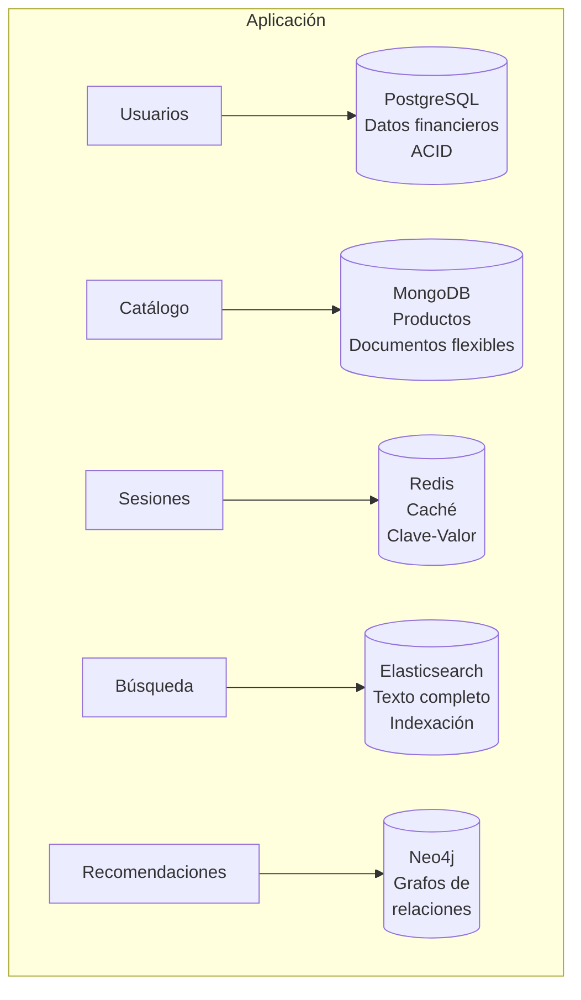
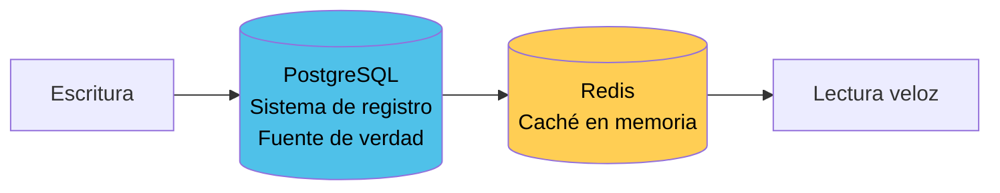
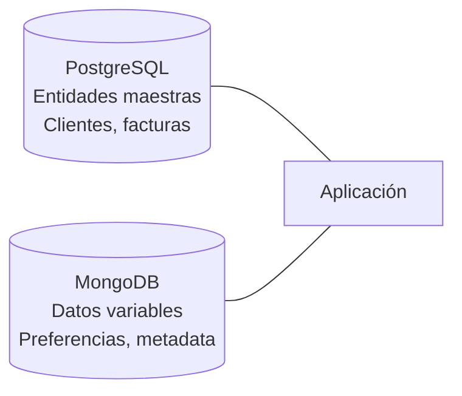
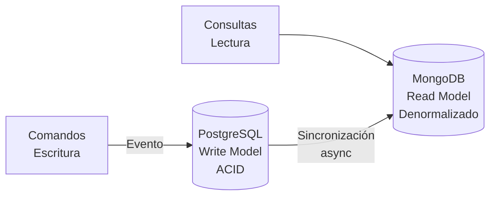
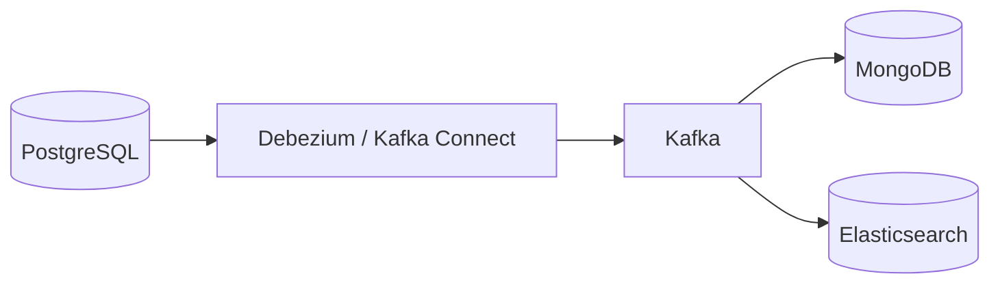
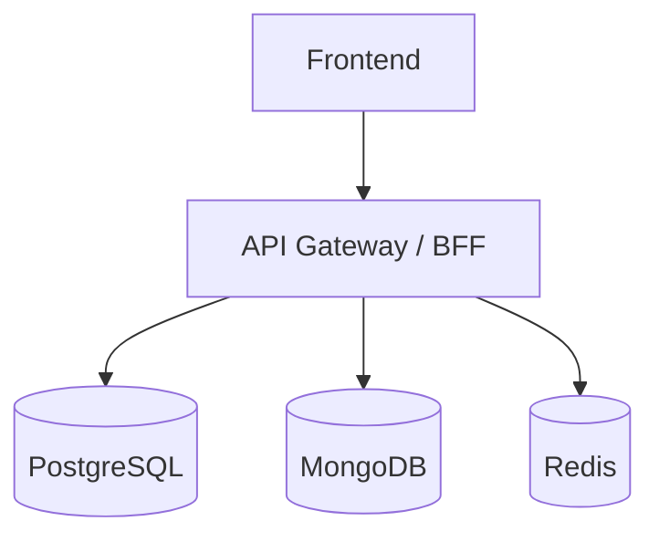

# 5. Integración de bases relacionales y NoSQL en soluciones empresariales

> [← Volver al README](../README.md)

---

## Índice

1. [Polyglot Persistence](#51-polyglot-persistence)
2. [Patrones de arquitectura híbrida](#52-patrones-de-arquitectura-híbrida)
3. [Casos reales en la industria](#53-casos-reales-en-la-industria)
4. [Estrategias de integración](#54-estrategias-de-integración)
5. [Consideraciones y buenas prácticas](#55-consideraciones-y-buenas-prácticas)
6. [Migración de SQL a NoSQL (y viceversa)](#56-migración-de-sql-a-nosql-y-viceversa)

---

## 5.1 Polyglot Persistence

**Polyglot Persistence** (persistencia políglota) es la práctica de usar múltiples tipos de bases de datos dentro de un mismo sistema, seleccionando cada una según el tipo de dato y patrón de acceso que mejor maneja.



### ¿Por qué Polyglot Persistence?

| Motivo | Explicación |
|:-------|:------------|
| **Cada DBMS es experto en algo** | No existe una base de datos que sea óptima para todo |
| **Evolución tecnológica** | El stack de datos madura y se diversifica |
| **Costos optimizados** | Usar la herramienta adecuada reduce costos de infraestructura |
| **Rendimiento específico** | Cada patrón de acceso tiene un motor optimizado |

### Ejemplo concreto

Una aplicación de e-commerce puede usar:

```
PostgreSQL     →  Órdenes de compra, pagos, facturación (ACID)
MongoDB        →  Catálogo de productos con atributos variables
Redis          →  Carrito de compras, sesiones de usuario
Elasticsearch  →  Búsqueda de productos con texto completo
Neo4j          →  Recomendaciones de productos basadas en relaciones
```

---

## 5.2 Patrones de arquitectura híbrida

### Patrón 1: Sistema de registro + caché



**Cuándo usarlo:** Datos que se leen frecuentemente pero se escriben ocasionalmente (perfiles de usuario, configuraciones).

**Flujo:**
1. La escritura siempre va a PostgreSQL (fuente de verdad)
2. Después de escribir, se actualiza Redis
3. Las lecturas van a Redis (microsegundos)
4. Si Redis no tiene el dato, se lee de PostgreSQL y se popular Redis

### Patrón 2: Datos maestros + documentos flexibles



**Cuándo usarlo:** Entidades con una parte fija y otra variable (ej: un cliente con datos fiscales fijos + preferencias de UI dinámicas).

**Ejemplo:**
```javascript
// PostgreSQL: tabla clientes
// Columnas: id, razon_social, cuit, email, telefono (estructura fija)

// MongoDB: colección preferencias_cliente
{
  "cliente_id": 1234,
  "tema": "oscuro",
  "idioma": "es",
  "notificaciones": { "email": true, "sms": false },
  "ultima_ubicacion": { "lat": -31.42, "lng": -64.18 }
}
```

### Patrón 3: Comandos (CQRS) con modelos separados



**Cuándo usarlo:** Sistemas donde el modelo de lectura es muy diferente al modelo de escritura (reportes, dashboards).

---

## 5.3 Casos reales en la industria

| Empresa | Stack de datos | Por qué |
|:--------|:---------------|:--------|
| **Uber** | PostgreSQL + Redis + Cassandra | PostgreSQL para viajes (transaccional), Redis para caché de geolocalización, Cassandra para datos históricos |
| **Netflix** | MySQL + Cassandra + Elasticsearch + Neo4j | MySQL para cuentas, Cassandra para catálogo, Elasticsearch para búsqueda, Neo4j para recomendaciones |
| **Mercado Libre** | PostgreSQL + MongoDB + Redis | PostgreSQL para transacciones, MongoDB para catálogo de productos, Redis para sesiones y caché |
| **Meta (Instagram)** | PostgreSQL + Redis + Cassandra | PostgreSQL para posts y usuarios, Redis para feeds, Cassandra para mensajes |
| **Spotify** | PostgreSQL + MongoDB + Cassandra + Redis | PostgreSQL para facturación, MongoDB para playlists, Cassandra para eventos de audio, Redis para caché |

---

## 5.4 Estrategias de integración

### 5.4.1 Sincronización manual (desde la aplicación)

```javascript
// Ejemplo en Node.js
async function crearUsuario(datos) {
  const session = await mongoose.startSession()
  session.startTransaction()

  try {
    // Guardar datos relacionales en PostgreSQL
    await pg.query(
      "INSERT INTO usuarios (nombre, email) VALUES ($1, $2)",
      [datos.nombre, datos.email]
    )

    // Guardar preferencias en MongoDB
    await db.preferencias.insertOne({
      usuario_id: datos.id,
      tema: datos.tema,
      notificaciones: datos.notificaciones
    })

    await session.commitTransaction()
  } catch (error) {
    await session.abortTransaction()
    throw error
  }
}
```

### 5.4.2 Cambio de captura (Change Data Capture — CDC)



CDC captura cambios en PostgreSQL y los replica automáticamente en otras bases de datos. Herramientas: **Debezium**, **Kafka Connect**, **AWS DMS**.

### 5.4.3 API Gateway / BFF (Backend For Frontend)



El BFF orquesta las consultas a múltiples bases de datos y devuelve una respuesta unificada.

---

## 5.5 Consideraciones y buenas prácticas

### Cuándo NO usar múltiples bases de datos

- **Equipos pequeños**: Mantener múltiples DBMS requiere conocimiento diverso
- **Prototipos / MVPs**: Una sola base de datos es más rápida de desarrollar
- **Aplicaciones simples**: Si una base de datos cubre todas las necesidades, no agregues complejidad innecesaria

### Buenas prácticas

1. **Cada DBMS tiene una responsabilidad clara** — no duplicar funcionalidad
2. **Transacciones distribuidas son complejas** — evitarlas, diseñar para consistencia eventual entre dominios
3. **Sincronización asincrónica** — usar eventos (Kafka, RabbitMQ) para mantener datos en sincronía
4. **Una fuente de verdad** — cada dato vive en un solo DBMS; los demás son réplicas o proyecciones
5. **Monitorización** — cada base de datos necesita su propio monitoreo (CPU, RAM, disco, consultas lentas)

---

## 5.6 Migración de SQL a NoSQL (y viceversa)

### ¿Cuándo migrar de SQL a NoSQL?

- El esquema cambia constantemente y causa downtime por migraciones
- Los datos son mayormente semiestructurados (JSON, documentos)
- Necesitás escalar horizontalmente y el costo de escalado vertical es prohibitivo
- Las consultas son simples (pocos joins) pero con mucha carga

### ¿Cuándo migrar de NoSQL a SQL?

- Las consultas requieren joins complejos y relaciones entre entidades
- Necesitás transacciones ACID fuertes entre múltiples tipos de datos
- El esquema se ha estabilizado y es predecible
- El equipo tiene más experiencia con SQL

### Estrategia de migración (paso a paso)

1. **Identificar el dominio** — no migrar todo, solo lo que tenga sentido
2. **Modelar los datos** en el nuevo DBMS
3. **Escribir en ambos** durante un período de transición (dual-write)
4. **Migrar datos históricos** (batch job)
5. **Validar consistencia** entre fuentes
6. **Cortar lecturas** al nuevo sistema
7. **Eliminar el viejo** cuando ya no haya dependencias

---

> **Siguiente:** [Glosario de términos →](06-glosario.md)
