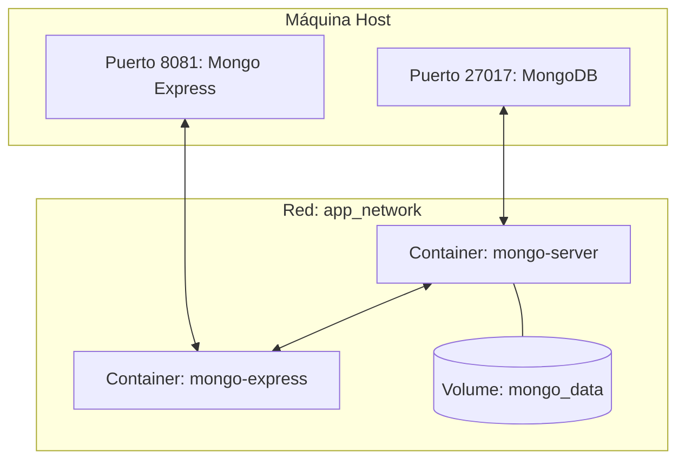
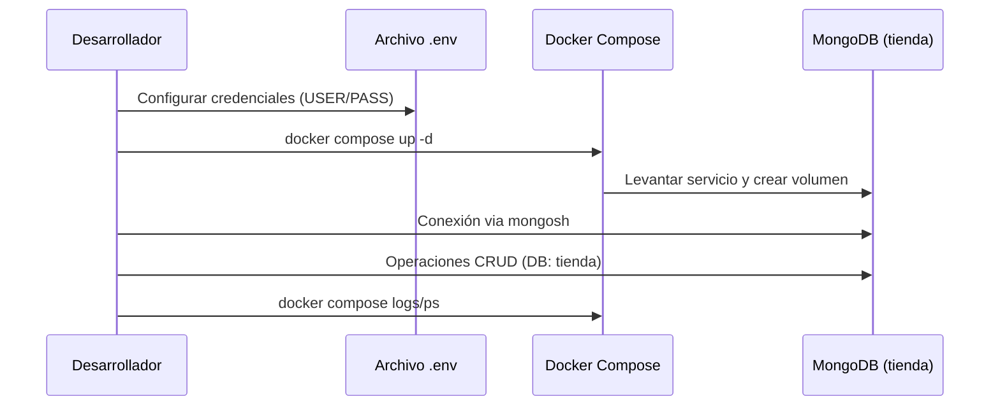

# Documentación Técnica de Implementación: Proyecto NoSQL (MongoDB)
## Práctica 4 — Gestión y Manejo de Base de Datos II

Este documento detalla el procedimiento técnico exacto seguido para el despliegue y administración de un ecosistema NoSQL basado en **MongoDB**. La implementación se basa estrictamente en la arquitectura de contenedores definida en el proyecto y el caso de uso de gestión de inventario para una "Tienda".

---

## 1. Arquitectura del Ecosistema

El despliegue utiliza Docker para orquestar un servidor de base de datos y una interfaz de administración, garantizando aislamiento y portabilidad.

### 1.1 Diagrama de Infraestructura


### 1.2 Flujo de Despliegue y Gestión


---

## 2. Fase 1: Configuración del Entorno

La seguridad y configuración de los servicios dependen de la correcta definición de variables de entorno.

### 2.1 Preparación del Archivo .env
Es obligatorio crear manualmente el archivo `.env` en la raíz de `practicas/p4-no-sql/`. Este archivo permite que `docker-compose.yml` inyecte las credenciales necesarias.

**Contenido requerido:**
```env
# Credenciales de acceso al motor de DB
MONGO_USER=root
MONGO_PASSWORD=mongo_secret_pass

# Credenciales de acceso a la interfaz web (Mongo Express)
ME_USER=admin
ME_PASSWORD=admin
```

---

## 3. Fase 2: Despliegue con Docker Compose

Utilizamos la orquestación para levantar el servidor y la herramienta de gestión en un solo paso.

### 3.1 Comandos de Control
| Acción | Comando | Impacto Técnico |
| :--- | :--- | :--- |
| **Despliegue** | `docker compose up -d` | Descarga imágenes (`mongo:latest`), crea la red y el volumen, e inicia servicios en modo *detached*. |
| **Auditoría** | `docker compose ps` | Lista los contenedores y verifica que los puertos 27017 y 8081 estén mapeados. |
| **Diagnóstico** | `docker compose logs -f` | Monitorea la salida estándar para verificar el mensaje "Waiting for connections" de MongoDB. |

---

## 4. Fase 3: Gestión de Datos (Caso de Uso: Tienda)

Siguiendo el ejemplo guiado del proyecto, se procedió a administrar la base de datos `tienda` a través de la CLI.

### 4.1 Conexión al Shell
```bash
docker exec -it mongo-server mongosh -u root -p mongo_secret_pass
```

### 4.2 Operaciones CRUD Realizadas

#### A. Creación y Selección de Contexto
```javascript
use tienda
```

#### B. Inserción de Documentos (Create)
Se poblaron las colecciones con productos tecnológicos:
```javascript
// Inserción individual
db.productos.insertOne({
  nombre: "Teclado mecánico RGB",
  precio: 89.99,
  categoria: "periféricos",
  stock: 150,
  disponible: true,
  tags: ["teclado", "mecánico", "rgb"]
});

// Inserción masiva
db.productos.insertMany([
  { nombre: "Mouse inalámbrico", precio: 49.99, categoria: "periféricos", stock: 200 },
  { nombre: "Monitor 27\" 4K", precio: 399.99, categoria: "monitores", stock: 30 }
]);
```

#### C. Consultas y Filtrado (Read)
```javascript
// Obtener productos de la categoría periféricos
db.productos.find({ categoria: "periféricos" }).pretty();

// Filtrar por rango de precio (>= 50 y <= 400)
db.productos.find({ precio: { $gte: 50, $lte: 400 } });
```

#### D. Actualización (Update)
```javascript
// Incrementar stock y modificar precio
db.productos.updateOne(
  { nombre: "Teclado mecánico RGB" },
  { $set: { precio: 79.99 }, $inc: { stock: -10 } }
);
```

---

## 5. Fase 4: Administración Gráfica (Mongo Express)

Para la validación visual de los datos, se utilizó el panel administrativo:
1. **Acceso:** `http://localhost:8081`
2. **Validación:** Se verificó la existencia de la base de datos `tienda` y la colección `productos`.
3. **Gestión:** Se realizaron ediciones directas sobre los documentos JSON para comprobar la reactividad del sistema.

---

## 6. Mantenimiento y Persistencia de Datos

El sistema está configurado para mantener los datos incluso si los contenedores se detienen.

*   **Detener servicios:** `docker compose down` (Mantiene el volumen `mongo_data`).
*   **Limpieza Total:** `docker compose down -v` (Elimina permanentemente la base de datos `tienda`).

---
**Guía generada para la práctica P4-NoSQL - Rama P8-RaulHeredia.**
