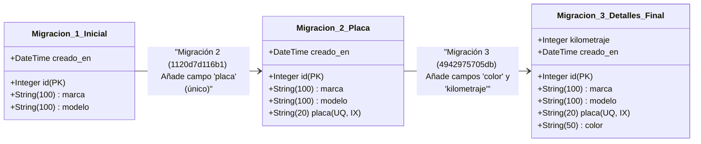
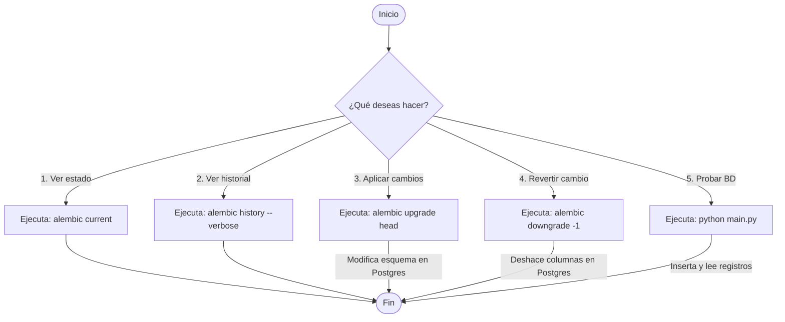

# Diagramas de Arquitectura y Evolución del Esquema (Mermaid)

Este archivo contiene los diagramas descriptivos de la **Práctica 6** representados mediante Mermaid.

---

## 1. Evolución Incremental de la Tabla `vehiculos` (Las 3 Migraciones)

El siguiente diagrama de clases muestra cómo se agregaron campos progresivamente en cada migración de Alembic:



---

## 2. Diagrama de Arquitectura del Sistema

Este diagrama ilustra cómo interactúa el script de Python, Alembic, el entorno virtual, el contenedor de Docker con PostgreSQL y la extensión "Database" de tu editor:

```mermaid
graph TD
    subgraph Computadora_Host [Entorno Local (Laptop)]
        subgraph Entorno_Python [Código Python]
            Main[main.py Script] -->|Usa la Sesión| DBConfig[database.py]
            DBConfig -->|Carga Variables| Dotenv[.env]
            Models[models/vehiculo.py] -->|Define Entidad| DBConfig
            
            Alembic[Alembic Engine] -->|Lee Metadatos| Models
            Alembic -->|Aplica Versiones| Versions[migrations/versions/*]
        end
        
        subgraph Editor [VS Code / Cursor]
            DBExt[Extensión Database] -.->|Conexión Visual| PGPort[Puerto Local 5432]
        end
    end

    subgraph Contenedor_Docker [Docker: ucatec-postgres]
        PGServer[Postgres Server] <--> PGPort
        
        subgraph Base_de_Datos [Base de Datos: p6_mantenimiento]
            TableVeh[Tabla: vehiculos]
            TableAlembic[Tabla: alembic_version]
        end
    end

    DBConfig -->|Consultas ORM via psycopg2| PGPort
    Alembic -->|Sentencias DDL Schema| PGPort
    PGServer <--> Base_de_Datos
```

---

## 3. Flujo de Trabajo para el Control de Migraciones

Flujo lógico al ejecutar comandos o el script `./control.sh`:


