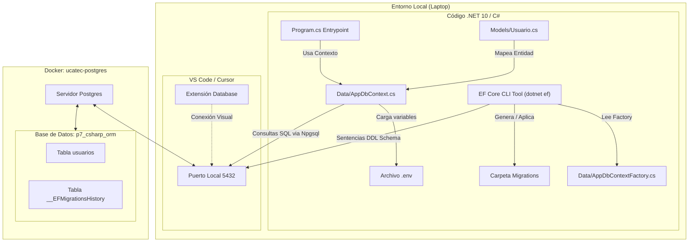
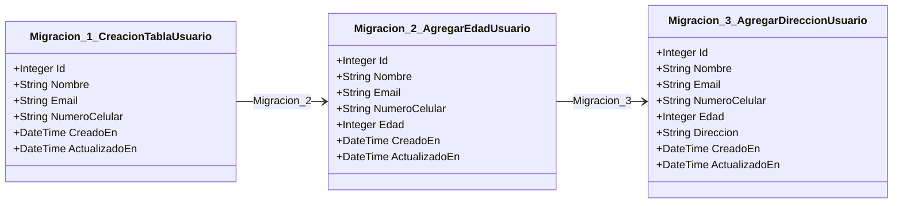

# Práctica 7: C# ORM con Entity Framework Core (3 Migraciones)

**Proyecto:** p7-csharp-orm  
**Rama:** `P7-RaulHeredia`  
**Base de Datos:** PostgreSQL 16 (Contenedor activo `ucatec-postgres`)  
**ORM:** Entity Framework Core (EF Core 9.0)  
**Proveedor de BD:** Npgsql (PostgreSQL provider)  
**Entorno de Ejecución:** .NET 10 (SDK 10.0.108)  

Este proyecto demuestra el uso de un ORM moderno en C# (Entity Framework Core) para mapear entidades orientadas a objetos a tablas de base de datos relacionales en PostgreSQL y administrar el ciclo de vida de la estructura mediante **3 migraciones sucesivas**.

---

## 1. Diagrama de Arquitectura del Sistema

El siguiente diagrama detalla cómo interactúa el código de C# (.NET 10), el CLI de Entity Framework Core, el archivo `.env`, tu contenedor activo de Docker y la extensión visual "Database" de tu editor:



---

## 2. Estructura Completa del Proyecto

```text
practicas/p7-csharp-orm/
├── .gitignore            # Archivos y carpetas ignoradas en Git (bin/, obj/, etc.)
├── control.sh            # Script interactivo en Bash para control total de comandos
├── README.md             # Documentación principal paso a paso
├── mermaid.md            # Diagramas descriptivos en formato Mermaid
└── P3CsharpOrm/          # Proyecto principal de la aplicación de consola C#
    ├── .env              # Configuración de credenciales de la BD
    ├── Program.cs        # Lógica de inicio y verificación de la base de datos
    ├── P3CsharpOrm.csproj # Archivo de proyecto de C# con dependencias
    ├── Models/
    │   └── Usuario.cs    # Clase de entidad que representa el Usuario (con Edad y Direccion)
    ├── Data/
    │   ├── AppDbContext.cs # Contexto principal de Entity Framework (Fluent API)
    │   └── AppDbContextFactory.cs # Factoría del contexto para el diseño en el CLI
    └── Migrations/       # Carpeta con el historial físico de las 3 migraciones
```

---

## 3. Guía Paso a Paso: Configuración y Ejecución

Sigue estos pasos detallados para configurar la base de datos, aplicar las migraciones y ejecutar la aplicación de consola localmente:

### Paso 1: Activar tu Contenedor de Docker
Asegúrate de que el contenedor de base de datos `ucatec-postgres` esté corriendo en tu laptop:
1. Abre tu terminal local.
2. Inicia el daemon de Docker si está inactivo:
   ```bash
   sudo systemctl start docker
   ```
3. Verifica que el contenedor `ucatec-postgres` esté arriba:
   ```bash
   docker ps
   ```

### Paso 2: Crear la Base de Datos en el Contenedor
Crearemos la base de datos específica `p7_csharp_orm` en el PostgreSQL de tu contenedor ejecutando en tu consola:
```bash
docker exec ucatec-postgres psql -U postgres -d postgres -c "CREATE DATABASE p7_csharp_orm;"
```

### Paso 3: Configurar el Archivo `.env`
El archivo `.env` está ubicado en la ruta [practicas/p7-csharp-orm/P3CsharpOrm/.env](file:///home/raulito/Documentos/Gestión y Manejo de Base de Datos II/mantenimiento2/practicas/p7-csharp-orm/P3CsharpOrm/.env). Asegúrate de que contenga las siguientes credenciales correspondientes a tu máquina:
```env
DB_HOST=localhost
DB_PORT=5432
DB_USER=postgres
DB_PASSWORD=mariane2019
DB_NAME=p7_csharp_orm
```

### Paso 4: Restaurar los Paquetes del Proyecto
Entra a la carpeta de la solución en tu terminal e inicializa el restablecimiento de paquetes NuGet:
```bash
cd practicas/p7-csharp-orm/P3CsharpOrm
dotnet restore
```

### Paso 5: Instalar la Herramienta de Migración de EF Core
Instala a nivel global el gestor de migraciones de .NET si aún no lo has hecho:
```bash
dotnet tool install --global dotnet-ef
```

### Paso 6: Aplicar las 3 Migraciones a PostgreSQL
Dado que el proyecto está compilado para .NET 9 pero el SDK de tu laptop es .NET 10, debemos ejecutar la migración utilizando la variable de entorno `DOTNET_ROLL_FORWARD=Major` para permitir compatibilidad automática:
```bash
export DOTNET_ROLL_FORWARD=Major
export PATH="$PATH:$HOME/.dotnet/tools"
dotnet ef database update
```
*Esto aplicará secuencialmente las 3 migraciones, creando la tabla de historial `__EFMigrationsHistory` y la tabla `usuarios` en PostgreSQL.*

### Paso 7: Ejecutar la Aplicación C# de Verificación
Inicia el conector para corroborar que la conexión sea exitosa:
```bash
export DOTNET_ROLL_FORWARD=Major
dotnet run
```
*Salida exitosa esperada:*
```text
🚀 Iniciando conector ORM - p3-csharp-orm...
✅ Archivo .env cargado correctamente.
🔍 Verificando conexión a la base de datos 'p7_csharp_orm' en localhost:5432...
🎉 ¡Conexión exitosa! El ORM se comunica perfectamente con PostgreSQL.
🏁 Finalizando ejecución del conector.
```

---

## 4. Historial Detallado de las 3 Migraciones

La base de datos se estructuró a través de un historial incremental de **3 migraciones** (cada una consta de su código `.cs` y su diseñador `.Designer.cs`):



1. **Migración 1: Creación de la Tabla (`CreacionTablaUsuario`)**
   * **Propósito:** Crea la tabla `usuarios` en PostgreSQL con sus columnas obligatorias base.
   * **Campos:** `Id` (PK), `Nombre` (NOT NULL, varchar 100), `Email` (NOT NULL, UNIQUE), `NumeroCelular` (varchar 20, UNIQUE), `CreadoEn` y `ActualizadoEn`.
2. **Migración 2: Adición del Campo `Edad` (`AgregarEdadUsuario`)**
   * **Propósito:** Agrega soporte para almacenar la edad del usuario de forma opcional.
   * **Campos:** `edad` (entero, Nullable).
3. **Migración 3: Adición del Campo `Dirección` (`AgregarDireccionUsuario`)**
   * **Propósito:** Agrega soporte para registrar la dirección de domicilio del usuario.
   * **Campos:** `direccion` (varchar 200, Nullable).

---

## 5. Visualización Visual en tu Editor (Extensión "Database")

Puedes conectarte visualmente a la base de datos `p7_csharp_orm` en tu panel lateral de bases de datos utilizando los siguientes parámetros:

* **Gestor:** PostgreSQL
* **Host:** `127.0.0.1` (o `localhost`)
* **Puerto:** `5432`
* **Usuario:** `postgres`
* **Contraseña:** `mariane2019`
* **Base de Datos:** `p7_csharp_orm`

### Tablas creadas:
1. **`__EFMigrationsHistory`**: Tabla de Entity Framework que guarda los registros de las 3 migraciones completadas. Puedes hacer clic derecho ➔ *Show Data* para observar la lista de las 3 migraciones aplicadas.
2. **`usuarios`**: Contiene las 8 columnas que se crearon progresivamente en las migraciones de este proyecto.

---

## 6. Panel de Control Interactivo (`control.sh`)

Para hacer que la ejecución de comandos de migración, restauración y compilación sea fácil y no requiera que escribas manualmente las variables del compilador, puedes ejecutar:

```bash
./control.sh
```

El script te proveerá de una interfaz en consola con opciones numéricas rápidas:
1. **Aplicar migraciones a la Base de Datos**: Ejecuta `dotnet ef database update` sincronizando PostgreSQL.
2. **Ejecutar la aplicación C# (dotnet run)**: Ejecuta el validador confirmando la conexión al contenedor.
3. **Revertir migraciones**: Permite retroceder a un estado de migración indicando su nombre.
4. **Salir**: Cierra el menú.
