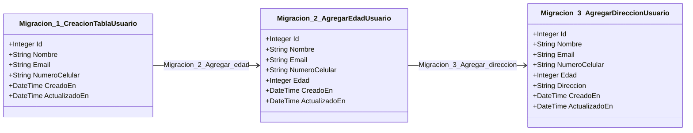
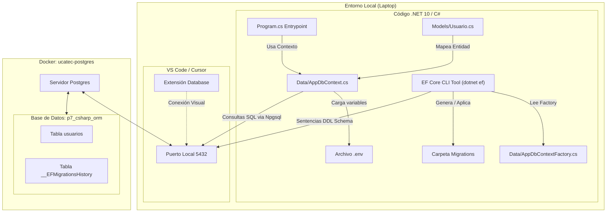
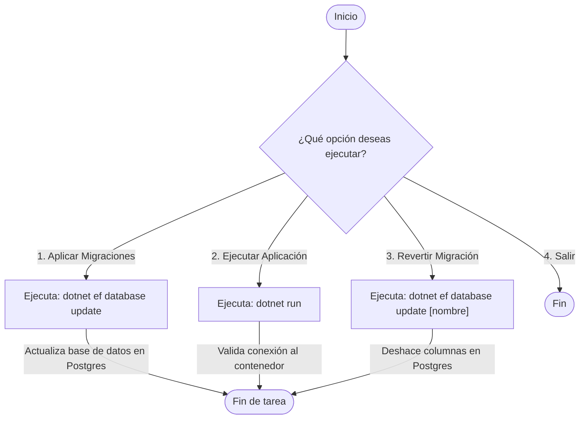

# Diagramas de Arquitectura y Evolución del Esquema (C# EF Core)

Este archivo contiene los diagramas descriptivos de la **Práctica 7** representados en formato Mermaid.

---

## 1. Evolución Incremental de la Tabla `usuarios` (Las 3 Migraciones)

El siguiente diagrama de clases muestra cómo se agregaron campos progresivamente en cada migración de Entity Framework Core:

---

## 2. Diagrama de Arquitectura del Sistema

Este diagrama ilustra cómo interactúa el código de C# (.NET 10), el CLI de Entity Framework Core, el contenedor de Docker con PostgreSQL y la extensión "Database" de tu editor:

---

## 3. Flujo del Panel de Control (`control.sh`)

Flujo lógico de opciones dentro del menú interactivo en Bash:

